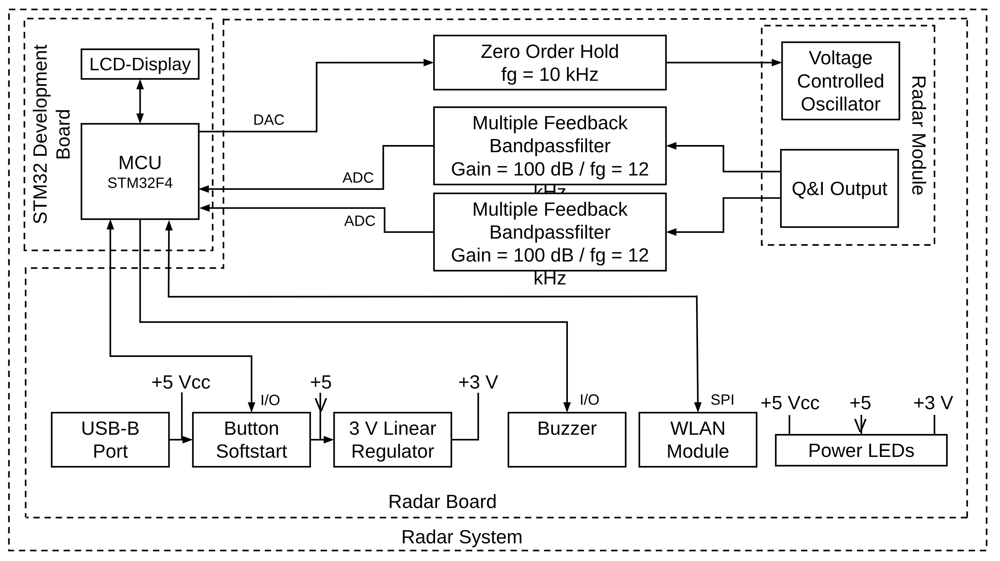
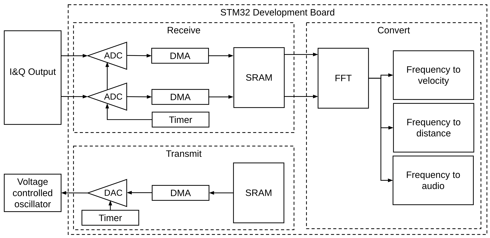

# Doppler Radar Detector

> 24 GHz radar that measures distance (FMCW) and speed (CW Doppler), streams a live spectrum to a touchscreen UI, bridges telemetry over WiFi, and fuses the radar result with camera-based angle-of-arrival detection on a desktop application. ZHAW PM4 team project, spring 2025.


## Block Diagram



MCU-side signal flow:



Full schematic of the analog / radar board: [docs/schematic.pdf](docs/schematic.pdf).

## Highlights

- **Dual-mode 24 GHz RF front-end** — two radar modules, one CW (speed), one FMCW (distance).
- **Six-stage analog signal conditioning** (multi-feedback bandpass, ~58 dB gain at 7 kHz, I/Q channels in parallel).
- **DMA-driven dual-simultaneous ADC** feeding a **CMSIS-DSP `arm_cfft_f32`** with **ping-pong double-buffering** and SDRAM-backed FFT history — zero dropped samples under FreeRTOS.
- **TouchGFX live UI** — the FFT output buffer in SDRAM is the GUI's source buffer. No polling layer between processing and render.
- **ESP32 WiFi bridge over SPI** (STM32 master, ESP32 slave on HSPI, handshake line) → FastAPI backend.
- **YOLOv8 angle-of-arrival fusion** on the desktop — webcam + neural net → class + angle; radar → speed; Android GPS (UDP NMEA) → ground-truth reference.

For the full long-form writeup including design rationale, signal-path math, and a candid retrospective, see **[SUMMARY.md](SUMMARY.md)**.

## Repository Map

| Path                      | What's there |
|---------------------------|---|
| `hardware/kicad/`         | KiCad schematic + PCB (V1, V3), exported PDF, component libraries |
| `hardware/simulations/`   | LTSpice MF bandpass filter simulation |
| `hardware/calculations/`  | MATLAB: time-of-flight (`tof.m`), noise (`sigma.m`) |
| `hardware/python-tools/`  | Jupyter notebook for tolerance analysis |
| `hardware/pinout/`        | STM32 pin assignments |
| `hardware/blockdiagram/`  | Source files for the system block diagram |
| `matlab/Bodeplot/`        | Frequency-response analysis of the filter chain |
| `matlab/CW_Doppler/`      | Reference signal-chain simulation (synthetic target → FFT → peak) |
| `firmware/stm32/`         | STM32F429 firmware — Core, Drivers, Middlewares, TouchGFX, user modules (`measurement.c`, `vco.c`, `timing.c`, `esp.c`, ...), STM32CubeIDE project |
| `firmware/esp32/`         | ESP-IDF project (WiFi STA + SPI slave bridge) |
| `backend/`                | FastAPI backend (early stub — see SUMMARY §13) |
| `desktop-app/`            | Python fusion app: YOLOv8 detection + Android GPS UDP listener + cv2 live overlay |
| `tests/hw-concept-tolerance/` | HW tolerance scripts |
| `docs/`                   | Concept report (PDF), block diagram, amplifier-stage test notes |
| `SUMMARY.md`              | Full long-form technical writeup (~3,700 words) |

## Folder Map (original ZHAW submission → this repo)

| Original                                        | New                           |
|-------------------------------------------------|-------------------------------|
| `02_Hardware/`                                  | `hardware/`                   |
| `04_Matlab/`                                    | `matlab/`                     |
| `06_Firmware/Radar_v2/`                         | `firmware/stm32/`             |
| `06_Firmware/ESP32/version_0.1/versio0.1/`      | `firmware/esp32/`             |
| `07_HW_FW_Concept_Test/01_Calculate_Tolerance/` | `tests/hw-concept-tolerance/` |
| `08_Test/01_hardware/Amplifierstage.md`         | `docs/amplifier-stage.md`     |
| `09_Desktop_Application/01_python/`             | `desktop-app/`                |
| `12_FastAPI/`                                   | `backend/`                    |
| `01_Admin/`, `11_Video/`, office docs           | dropped (content extracted into `SUMMARY.md`) |

## Quickstart

### STM32 firmware

Requires **STM32CubeIDE** (any recent version). Either:

- Import the `STM32CubeIDE/` folder as an existing Eclipse project, or
- Open `firmware/stm32/Radar_v2.ioc` with STM32CubeMX and regenerate the project.

Build and flash to an **STM32F429 Discovery** board. Serial log on UART1.

### ESP32 firmware

Requires **ESP-IDF** (v5.x recommended). From `firmware/esp32/`:

```bash
idf.py set-target esp32
idf.py build
idf.py -p /dev/ttyUSB0 flash monitor
```

Before flashing, edit `main/wifi.c` and replace the placeholder `WIFI_SSID` / `WIFI_PASS` with your network credentials.

### FastAPI backend

```bash
cd backend
python3 -m venv .venv && source .venv/bin/activate
pip install -r requirements.txt
uvicorn main:app --reload
```

Note: the backend is an early scaffold — see `SUMMARY.md` §13.

### Desktop application

```bash
cd desktop-app
python3 -m venv .venv && source .venv/bin/activate
pip install -r requirements.txt
python collect_main.py
```

The first run auto-downloads the YOLOv8n weights (~6 MB) via `ultralytics`. For ground-truth speed reference, run an Android app that streams NMEA-0183 `$GPVTG` / `$GNVTG` sentences over UDP to port 5005 on your laptop. The app tolerates the GPS feed being absent.

## Credits

ZHAW PM4 team project, spring semester 2025. Authors: Dennis Rathgeb, Bryan Uhlmann, Benjamin Tschopp.

The original collaboration took place on ZHAW's internal GitHub instance; this public repository is a slimmed, portfolio-oriented mirror.

## License

MIT — see [LICENSE](LICENSE).
